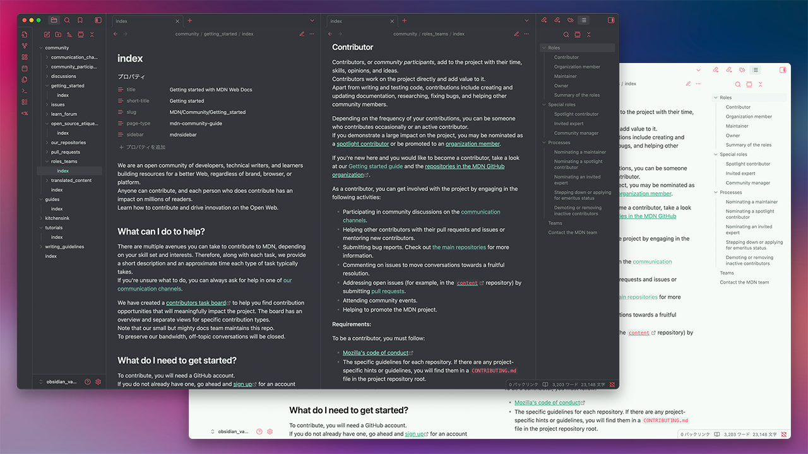
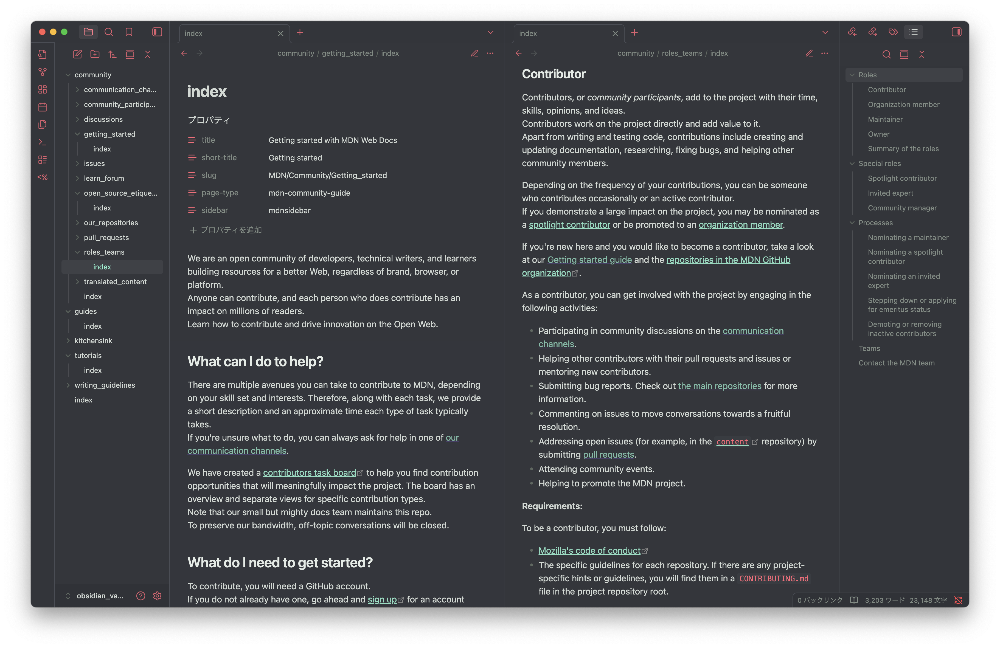
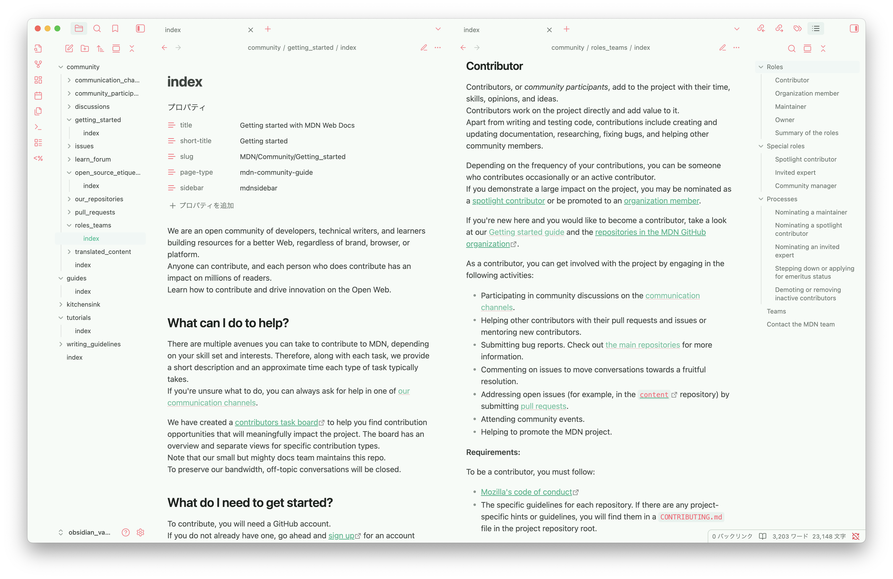

# Planetz Roller for Obsidian

**Planetz Roller** is a colorful, soft-toned theme with a flat, painted look across the entire interface. The name comes from the [_Planetz Big Swig Roller_](https://splatoonwiki.org/wiki/Planetz_Big_Swig_Roller), a roller-type weapon in Splatoon 3.

## Installation

1. Download the latest `theme.css` and `manifest.json`.
2. Place them inside `.obsidian/themes/Planetz Roller`.
3. In Obsidian, open *Settings → Appearance → Themes* and select **Planetz Roller**.

## License

Released under the MIT license.

